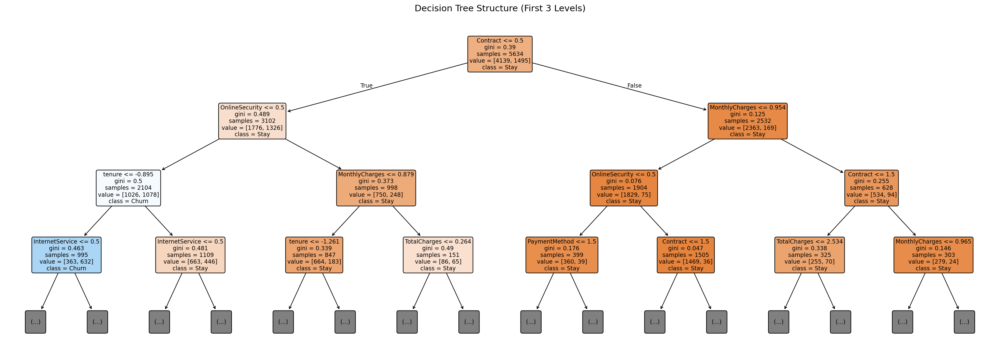
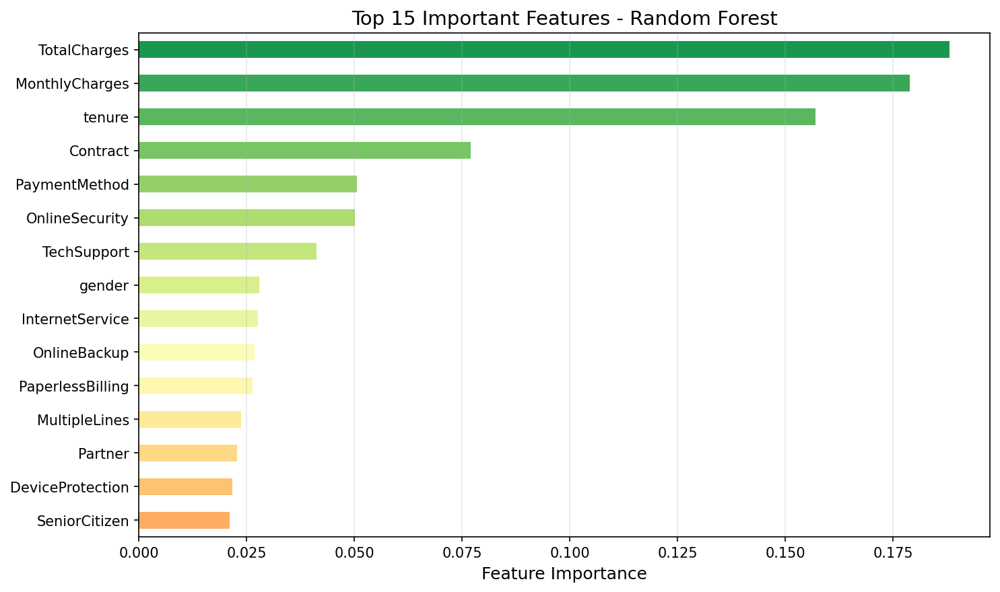
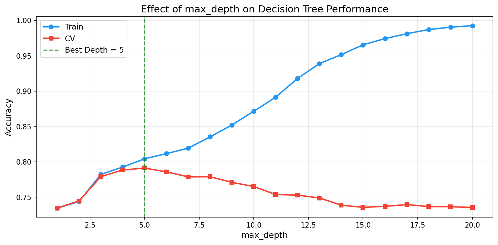
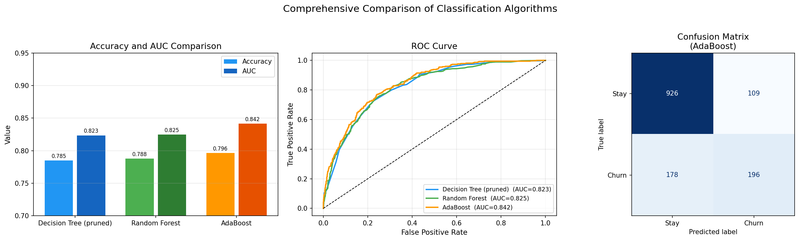
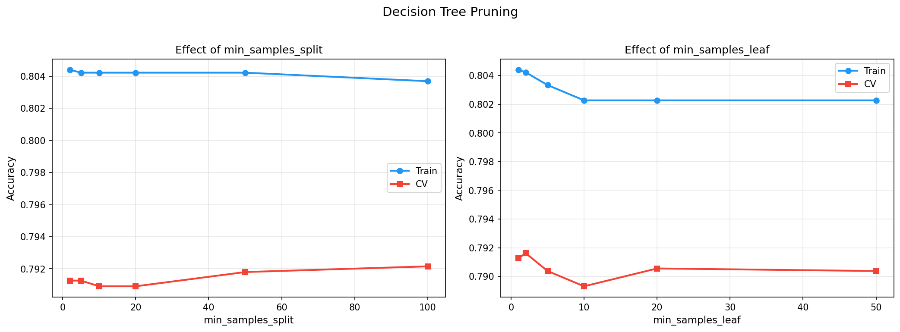

# 📊 Telco Customer Churn Prediction

This project aims to predict customer churn using tree-based machine learning models. By analyzing the `Telco-Customer-Churn.csv` dataset, the project implements and compares various classification algorithms to identify customers who are likely to leave the service.

## 🛠️ Algorithms Implemented
- **Decision Tree:** Evaluated in both default and pruned states to prevent overfitting.
- **Random Forest:** Utilized for its stability and to extract the most important features driving customer churn.
- **AdaBoost:** Applied ensemble learning techniques to boost predictive accuracy.

## Key Features
- **Robust Data Preprocessing:** Automated handling of missing values (`NaN`), label encoding for categorical data, and standard scaling for continuous features without data leakage.
- **Comprehensive Evaluation:** Models are compared using Accuracy, AUC-ROC scores, 5-Fold Cross-Validation, and Classification Reports.
- **Advanced Visualizations:** Automatically generates and saves visual insights, including model comparison charts, ROC curves, confusion matrices, and feature importance graphs.

## 🚀 How to Run

1. Install the required dependencies:
```bash
pip install pandas numpy matplotlib scikit-learn
```

Ensure the Telco-Customer-Churn.csv dataset is located in the same directory as the script.

Run the main script:
```bash
python main.py
```

## 📂 Outputs
Upon successful execution, an outputs directory will be created automatically. All generated visualizations (e.g., decision tree structure, ROC curves, and feature importance) will be saved there as high-quality PNG files.






